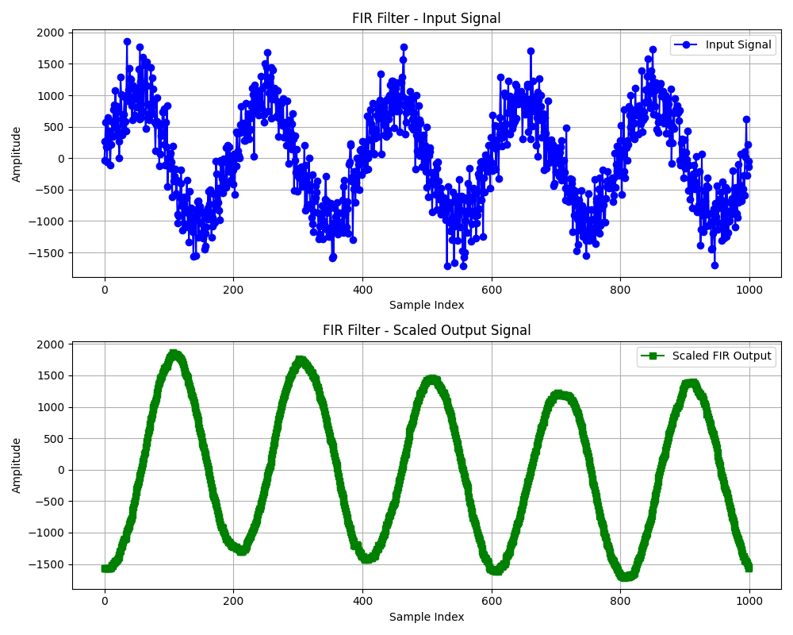

# FIR Filter Simulation Using Verilog and Python

## 📌 Overview

This project demonstrates the implementation and simulation of an **8-tap low-pass FIR filter**. The system integrates **Python** for signal generation, FIR coefficient design, and visualization with a **Verilog HDL** implementation for hardware-level simulation.

## 🧠 Key Features

- Noisy sine wave signal generation using Python
- FIR filter coefficient generation using the Hamming window
- Fixed-point coefficient quantization
- Verilog implementation of FIR filter
- Testbench for simulation using Icarus Verilog and GTKWave
- Visualization of input and output signals

---

## 📁 Project Structure

```plaintext
.
├── data_gen.py                    # Generate noisy signal and FIR coefficients
├── generate_fir_coefficients.py  # Standalone FIR coefficient generator
├── input_data.txt                # Input signal (int16)
├── fir_coeffs.txt                # FIR filter coefficients (fixed-point)
├── fir_filter.v                  # Verilog FIR filter design
├── tb_fir_filter.v               # Testbench for FIR filter
├── output_data.txt               # Output signal (from Verilog simulation)
├── output_visualize.py          # Python script to visualize input vs output
├── fir_filter.svg                # FIR filter block diagram
├── fir_input_vs_output.png      # Visualization of input and filtered output
├── noisy_signal_plot.png        # Original vs noisy signal
├── fir_coeff_plot.png           # FIR coefficients stem plot
````

---

## 🧪 Workflow

### 1. Generate Input Signal and FIR Coefficients

```bash
python data_gen.py
```

* Produces `input_data.txt` and `fir_coeffs.txt`
* Plots:

  * `noisy_signal_plot.png`
  * `fir_coeff_plot.png`

### 2. Compile and Simulate Verilog FIR Filter

Ensure you have **Icarus Verilog** and **GTKWave** installed.

```bash
iverilog -o fir_sim tb_fir_filter.v fir_filter.v
vvp fir_sim
```

* Generates `output_data.txt`

### 3. Visualize Input vs Output

```bash
python output_visualize.py
```

* Produces `fir_input_vs_output.png`

---

## 📐 Technical Details

* **Sampling Frequency**: 100 Hz
* **Signal Frequency**: 5 Hz
* **Noise Level**: Gaussian noise, std=300
* **FIR Filter**:

  * 8 taps
  * Hamming window
  * Cutoff = 10 Hz
  * Fixed-point Q12 format

---

## 🧾 FIR Coefficients Example (Q12 scaled)

```
36, 196, 672, 1144, 1144, 672, 196, 36
```

Used in Verilog as:

```verilog
coeff[0] = 16'sd36;
coeff[1] = 16'sd196;
...
coeff[7] = 16'sd36;
```

---

## 🖼 Visuals

### FIR Filter Block Diagram


### Input vs Output Signal



---

## 🛠 Tools Used

* **Python 3** (NumPy, Matplotlib, SciPy)
* **Icarus Verilog**
* **GTKWave**

---

## 📌 Author

**Aayush Gid**
Electronics and Communication Engineering
B.Tech 3rd Year

---

## 📄 License

This project is open-source and available under the [MIT License](LICENSE).
